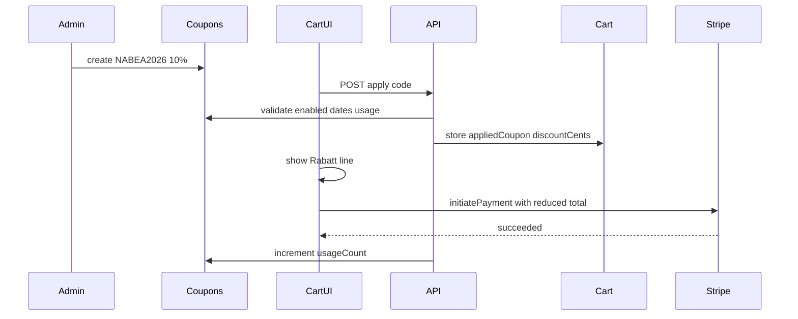

# Coupon and discount codes

## Decisions (locked)

- Keep existing automatic **Discounts** (Shop → Discounts / `applyDiscounts.ts`) as a separate sale-pricing tool.
- New **Coupons** system is separate (codes entered in cart/checkout).
- Coupons **stack on top of** sale prices (apply to the already-discounted line/subtotal the cart already uses).
- Build **custom** (no third-party coupon plugin) to match EUR/cents, shipping wrapper, and German UI.

## Admin dashboard (create / edit / list)

Yes — full Payload admin UI under **Shop → Gutscheine / Codes** (collection `coupons`):

- List all codes (code, type, value, enabled, usage)
- Create new
- Edit existing (change %, € amount, dates, limits, enable/disable)
- Delete when needed

Admin picks **type** when creating/editing:

| What the client calls it | Admin `type` | `value` meaning | Example |
|---|---|---|---|
| Discount code (promo) | `percentage` | percent off merchandise (1–99) | `NABEA2026` → 10 |
| Coupon (money) | `fixed` | euros stored as **cents** | goodwill → €20.00 → `2000` |

Same entry form for both; fields adapt by type (show “%” vs “€”). This is **not** the existing automatic product **Discounts** collection (sale pricing without a code).

## Code fields (one collection)

- `code` (unique, normalized uppercase)
- `type`: `percentage` | `fixed`
- `value` (percent 1–99, or fixed amount in **cents**)
- `enabled` checkbox
- `startsAt` / `endsAt` (optional end)
- `usageLimit` (optional total uses; blank = unlimited)
- `usageCount` (read-only counter)
- `perCustomerLimit` (optional; for guests keyed by checkout email)
- `minOrderCents` (optional minimum merchandise subtotal)
- `note` (admin-only, e.g. “goodwill for broken package”)

Examples:
- `NABEA2026` → percentage 10
- Goodwill → fixed `2000` (€20.00), `usageLimit: 1`

### Neon migration (files + MCP apply)

1. Write standalone reviewable SQL in `src/migrations/` (plus TS companion per project rules) for:
   - `coupons` table (+ enums/indexes as needed)
   - cart columns (`applied_coupon_id`, `coupon_code`, `coupon_discount_cents`, …)
   - order columns (same snapshots)
   - safe guards (`IF NOT EXISTS` where appropriate)
2. **Also apply that SQL on Neon via MCP** (`run_sql` / `run_sql_transaction` on project `cold-dust-03342807` / payload-neon), after a quick dry-read of current schema.
3. Keep the `.sql` file in the repo so the change is auditable and re-runnable; do not rely on MCP-only schema drift.
4. Do not run destructive SQL without confirmation; this migration is additive only.

## Totals math (server-authoritative)

```
merchandiseSubtotal = cart.subtotal   // already reflects product Discounts / variant prices
couponDiscount      = percent ? round(subtotal * pct/100) : min(fixed, subtotal)
payableMerchandise  = max(0, merchandiseSubtotal - couponDiscount)
shipping            = calculateShippingCents(payableMerchandise)  // free-shipping threshold after coupon
chargeTotal         = payableMerchandise + shipping
```

Wire into existing [`src/utilities/stripeInitiatePaymentWithShipping.ts`](src/utilities/stripeInitiatePaymentWithShipping.ts) so Stripe charges `chargeTotal`, not raw cart subtotal. Persist coupon + discount amounts on cart and copy onto order at confirm.



## API

- `POST /api/coupons/apply` — body `{ code, cartId, secret?, email? }` → validate + attach to cart
- `POST /api/coupons/remove` — clear from cart
- Validation failures return clear German messages (invalid, expired, disabled, usage exhausted, below min order)

Never trust client-supplied discount amounts.

## Data on cart / order

Extend carts (override in [`src/collections/Carts/index.ts`](src/collections/Carts/index.ts)) and orders (override in [`src/collections/Orders/index.ts`](src/collections/Orders/index.ts)):

- `appliedCoupon` → relationship to `coupons` (or store code string + id)
- `couponCode` (snapshot string)
- `couponDiscountCents` (number)
- Optional: `couponType` / `couponValue` snapshot for invoices/emails

After successful payment (`confirmOrder` path / order `afterChange`), increment `usageCount` once (idempotent per order).

## Storefront UI

Shared small form component used in:

- [`src/components/Cart/CartModal.tsx`](src/components/Cart/CartModal.tsx)
- [`src/components/checkout/CheckoutPage.tsx`](src/components/checkout/CheckoutPage.tsx)

Behavior:

- Input + “Einlösen” / remove
- Totals: Zwischensumme → Rabatt (−€X) → Versand → Gesamt
- Applied code shown as chip (e.g. `NABEA2026`)

German copy only on storefront.

## Usage limits

- Global `usageLimit` / `usageCount`
- Optional `perCustomerLimit`: for logged-in users by user id; for guests by normalized email once known at checkout (cart apply without email only checks global limit; re-validate at payment initiate with email)

## Out of scope (this phase)

- Changing automatic product Discounts behavior
- Referral programs / multi-coupon stacking (one coupon per cart)
- Free-product / BOGO coupons

## Acceptance checks

- Admin can create/edit/list both types in Shop admin: percentage discount codes and fixed € coupons
- Admin can create % and fixed coupons, toggle enabled
- Cart + checkout can apply/remove; totals update immediately
- Stripe charge matches post-coupon + shipping total
- Coupon stacks on products already reduced by Discounts
- One-time coupon cannot be reused after successful order
- Invalid/expired/disabled codes show German errors
- Neon SQL migration file committed under `src/migrations/`
- Same migration successfully applied on Neon via MCP
