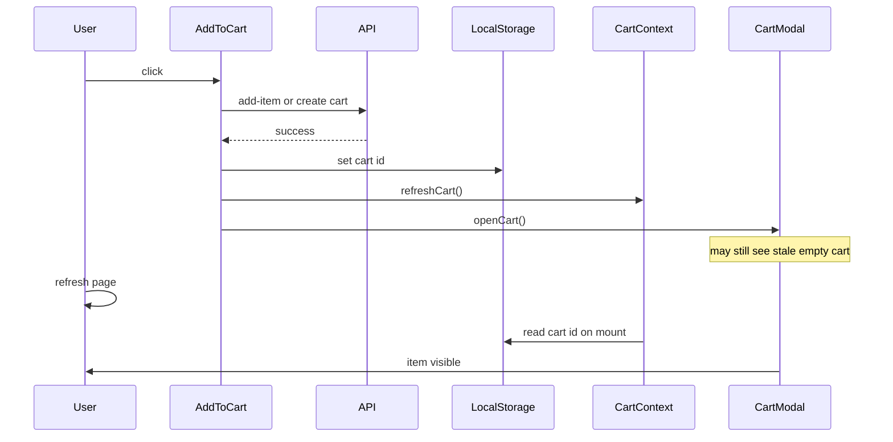

# Fix add-to-cart UI sync and shop quick-add

## What’s broken

### 1. Product page: item added but cart looks empty until refresh

[`src/components/Cart/AddToCart.tsx`](src/components/Cart/AddToCart.tsx) adds via raw `fetch` (existing cart → `POST /api/carts/:id/add-item`, or create cart → `POST /api/carts`), then:

```ts
await refreshCart()
toast.success(...)
openCart()
```

[`CartModal`](src/components/Cart/CartModal.tsx) only renders items from `useCart().cart`. After a successful server write, the React cart context often still has the old empty state when the drawer opens—especially on first add (new cart ID written to `localStorage` then `refreshCart()` before the provider fully rebinds). Full page reload re-reads `localStorage` and shows the item. That matches the reported bug.



### 2. Shop page: “In den Warenkorb” only navigates

In [`src/components/ProductGridItem/index.tsx`](src/components/ProductGridItem/index.tsx) the CTA is a `<Link href={productPageHref}>`, not an add action. Image/title still go to the product page; the button currently does too.

## Approach

### A. Shared add-to-cart helper + reliable UI refresh

Extract the add logic from `AddToCart.tsx` into something like [`src/utilities/addToCart.ts`](src/utilities/addToCart.ts) (or `src/lib/addToCart.ts`) that:

1. Uses existing `localStorage` cart id / secret
2. Calls add-item or creates the cart (same API paths as today)
3. Writes cart id/secret to `localStorage` when creating
4. Returns success/failure clearly

Then update [`AddToCart.tsx`](src/components/Cart/AddToCart.tsx) to:

1. Call the helper
2. `await refreshCart()`
3. If cart still empty / missing the new line (first-add race), call `refreshCart()` once more or briefly wait until `cart.items` updates
4. Only then `openCart()` and success toast
5. Keep variant rules: products with variants still require a selected variant (button stays disabled without one)

Default: prefer fixing the custom fetch + refresh sequence (already battle-tested in this repo) over switching to plugin `addItem` until `node_modules` is available to verify the plugin API. If `useCart().addItem` proves reliable after install, we can switch the helper to it in the same change—but the acceptance criterion is drawer + badge update without reload.

### B. Shop quick-add on the grid card

In [`ProductGridItem`](src/components/ProductGridItem/index.tsx):

1. Replace the CTA `<Link>` with a `<button type="button">`
2. On click: `preventDefault` / `stopPropagation`, resolve product + variant:
   - No variants → add product
   - Variants + selected pill → add that variant
   - Variants + no pill selected → toast “Bitte zuerst eine Variante wählen” (same rule as product page); do not navigate
3. Reuse the shared helper + `refreshCart` + `openCart` + success toast
4. Keep image and title as links to the product page so customers can still open the PDP

Out-of-stock / notify states stay as they are (disabled / notify label), not silent navigation.

### C. Files to touch

- New: shared add helper (`src/utilities/addToCart.ts` or `src/lib/addToCart.ts`)
- Edit: [`src/components/Cart/AddToCart.tsx`](src/components/Cart/AddToCart.tsx)
- Edit: [`src/components/ProductGridItem/index.tsx`](src/components/ProductGridItem/index.tsx)
- Possibly small tweak in [`src/components/Cart/CartModal.tsx`](src/components/Cart/CartModal.tsx) only if we need to avoid flashing the empty state while refresh is in flight

No Neon / schema changes.

## Acceptance checks

- Product page, empty cart: add item → drawer opens with that item immediately (no refresh)
- Product page, existing cart: add again → quantity/line updates in drawer without refresh
- Header cart badge updates without refresh
- Shop: click image/title → product page
- Shop: select variant pill (if any) → click “In den Warenkorb” → item added, drawer opens, stay on shop
- Shop: variant product, no pill selected → toast, no navigation, no add
- Out-of-stock card CTA still blocked / notify behavior unchanged
