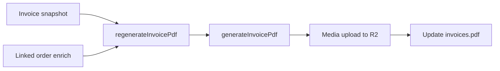

# Invoice PDF recovery and admin fixes

## Context

- 8 invoices exist in Neon; Media URLs already point at R2.
- Only `Rechnung-NABEA-2026-0008.pdf` is on R2 (200). `0001`–`0007` are 404.
- Blob recovery is out of scope — regenerate from data we already have.
- Invoice rows store number, issued date, amounts, shipping, and line-item snapshots. Buyer address / payment method / coupon lines are not on the invoice — pull those from the linked order when regenerating so PDFs stay complete.

## Approach

**Keep Rechnungsnummer and issued date.** Do not create new invoice numbers. Rebuild the PDF, upload new Media to R2, point `invoices.pdf` at it. Old orphan Media rows can stay (harmless).

**Source of truth for money/lines:** invoice snapshot (`number`, `issuedAt`, `amountGross`/`Net`/`Tax`, `shippingCents`, `lineItems`).
**Enrich from order:** `resolveInvoiceBuyerAddress`, payment method label, product discount, coupon — same helpers already in [`src/utilities/createOrderInvoice.ts`](src/utilities/createOrderInvoice.ts).

## Implementation

### 1. Regenerate utility

Add [`src/utilities/regenerateInvoicePdf.ts`](src/utilities/regenerateInvoicePdf.ts):

- Load invoice (depth 1) + linked order (depth 2).
- Call existing `generateInvoicePdf` with snapshot totals/lines + order enrichments.
- Reuse `createMediaPdf` pattern from `createOrderInvoice`.
- `payload.update` invoice `pdf` to the new media id.
- Return `{ invoiceNumber, mediaId, filename }` or a clear error.

### 2. Admin API

Add [`src/app/api/invoices/regenerate/route.ts`](src/app/api/invoices/regenerate/route.ts):

- Admin-only (`checkRole(['admin'])`), same auth pattern as [`src/app/api/invoices/export/route.ts`](src/app/api/invoices/export/route.ts).
- `POST` body: `{ id?: number }` for one invoice, or `{ missingOnly: true }` for all whose public PDF URL HEAD/GET fails.
- Idempotent: safe to re-run; always writes a fresh PDF file.

### 3. Admin UI — list PDF column

- Add [`src/components/admin/InvoicePdfCell.tsx`](src/components/admin/InvoicePdfCell.tsx): if `rowData.pdf.url` exists, render a download link (`download` + open); otherwise show “Missing”.
- Wire `pdf.admin.components.Cell` in [`src/collections/Invoices.ts`](src/collections/Invoices.ts).
- Regenerate import map.

### 4. Admin UI — regenerate + ZIP

Update [`src/components/admin/InvoiceExportPanel.tsx`](src/components/admin/InvoiceExportPanel.tsx):

- Add **“Regenerate missing PDFs”** button → `POST /api/invoices/regenerate` with `{ missingOnly: true }`, show success/failure counts.
- Fix ZIP client: delay `URL.revokeObjectURL` (e.g. `setTimeout` ~1s) so repeat downloads work.
- Show API `failures` when export is partial.

Harden [`src/app/api/invoices/export/route.ts`](src/app/api/invoices/export/route.ts):

- Keep packing whatever fetches succeed.
- Return failure summary in a response header the panel can read (e.g. `X-Invoice-Export-Failures`) so UI can warn “packed 1 of 8”.
- Do not hard-404 when at least one PDF packed (already the case); improve messaging when some fail.

### 5. Docs touch

Short note in [`context-md/invoices-system.md`](context-md/invoices-system.md): regenerate path + no Blob recovery.

## Out of scope

- Vercel Blob recovery.
- Changing invoice numbering or re-emailing customers.
- Deleting old Media orphans.

## Verification after deploy

1. In admin → Shop → Invoices → **Regenerate missing PDFs**.
2. HEAD all 8 `Rechnung-*.pdf` URLs → 200.
3. List PDF icon downloads; detail PDF still works.
4. ZIP export twice on the same date range — both succeed with all files.
