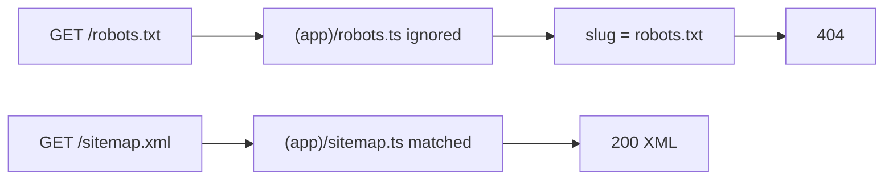

# Nabea SEO and AI Discovery Plan

## Locked decisions

- Canonical host: `https://www.nabea.at` (live 308 from apex to www). Align `NEXT_PUBLIC_SERVER_URL` and all absolute SEO URLs to www.
- Language: German only (`de` / `de-AT`). No hreflang, no EN locales.
- Skills: [seo-audit](.agents/skills/seo-audit/SKILL.md) for crawl/index/on-page; [ai-seo](.agents/skills/ai-seo/SKILL.md) for citations, llms.txt, agent readiness; keep existing Next helpers.
- Out of scope: OKF, WebMCP, category landing pages, payload-auth, Merchant Center code, inventing blog farmland, separate AI-only content.

## Current baseline

Already in code from earlier phases:

- `lang="de"`, branded metadata, Organization/WebSite JSON-LD ([siteJsonLd.ts](src/utilities/siteJsonLd.ts))
- Product + Breadcrumb + FAQ JSON-LD ([productJsonLd.ts](src/utilities/productJsonLd.ts))
- Sitemap listing `/`, `/shop`, published pages, published products ([sitemap.ts](src/app/(app)/sitemap.ts))
- Private-route disallow list ([robots.ts](src/app/(app)/robots.ts))

Confirmed production bug: `/robots.txt` returns 404 because Next.js 15 only registers `robots` at the app root. File is currently at `src/app/(app)/robots.ts`, so the request hits `[slug]` then notFound. Sitemap under `(app)` does match and currently returns 200.

---

## Phase 0 — Unblock crawl discovery (ship first)

1. Move [src/app/(app)/robots.ts](src/app/(app)/robots.ts) to [src/app/robots.ts](src/app/robots.ts).
2. Move [src/app/(app)/sitemap.ts](src/app/(app)/sitemap.ts) to [src/app/sitemap.ts](src/app/sitemap.ts) for consistency.
3. Extend robots (ai-seo bot stance):
   - Keep existing private-path Disallow for `*`.
   - Explicitly Allow citation crawlers: GPTBot, ChatGPT-User, PerplexityBot, ClaudeBot, anthropic-ai, Google-Extended, Bingbot.
   - Disallow training-only CCBot sitewide.
   - Sitemap and Host use www base from [getURL.ts](src/utilities/getURL.ts).
4. Harden sitemap: try/catch around Payload queries so a DB blip returns home+shop instead of 500; published-only; skip empty/`home` slugs.
5. After deploy: verify `https://www.nabea.at/robots.txt` and `/sitemap.xml`. Confirm loc hosts are www.

Needs your attention: set Vercel production `NEXT_PUBLIC_SERVER_URL=https://www.nabea.at` if it still points at apex or a preview host.

---

## Phase 1 — Technical SEO audit fixes

Using seo-audit priority order, fix only real High/Medium gaps:

- Self-canonicals and absolute URLs via [generateMeta.ts](src/utilities/generateMeta.ts), CMS [slug page](src/app/(app)/[slug]/page.tsx), [product page](src/app/(app)/products/[slug]/page.tsx).
- Confirm noindex on cart, checkout, account, auth, find-order, newsletter.
- Shop facets stay filter-only (no new category landings).
- Spot-check CMS slug quality (umlaut mangling); fix in admin only if URLs are broken.
- Validate schema with Rich Results Test or browser (not web_fetch alone).

---

## Phase 2 — German on-page SEO

Focus: `/`, `/shop`, 9 CMS pages, product templates.

- Code-owned routes: improve German title/description defaults where still generic.
- CMS pages/products: draft German title + meta description copy in `context-md/` for paste into Payload SEO fields. No keyword stuffing.
- Align H1 with primary intent on home/shop/about where the template controls it.
- Brand OG/logo in Organization + mergeOpenGraph deferred until you provide assets.

---

## Phase 3 — AI extractability on existing pages

Per ai-seo: people-first structure that also helps ChatGPT/Perplexity.

- Answer-first blocks on Uber uns / Pflege / product FAQ surfaces.
- Keep FAQPage + Product schema; visible FAQ text must match JSON-LD.
- Prefer owned official pages over listicle bait. No separate AI content.

---

## Phase 4 — Machine-readable AI files

1. Add [src/app/llms.txt/route.ts](src/app/llms.txt/route.ts) serving UTF-8 markdown per llmstxt.org:
   - H1 Nabea; German summary (handmade olive wood + ceramics, Wien/AT)
   - Curated links: Shop, Uber uns, Anfrage, key legal pages, contact email
   - Optional: language de-AT, Instagram
2. Add [src/app/llms-full.txt/route.ts](src/app/llms-full.txt/route.ts): same overview plus published CMS titles/URLs and a capped product list from Payload.
3. Paths: `/llms.txt` and `/llms-full.txt` at site root.

Skip pricing.md (not a SaaS pricing model).

---

## Phase 5 — Launch checklist

- Search Console property for `https://www.nabea.at`, submit sitemap.
- Manual AI visibility sample: 10-15 German queries across Google / ChatGPT / Perplexity.
- Optional ops (no code): Google Business Profile + Merchant Center.

---

## Order and checks

Ship Phase 0 first. Phases 1-4 follow after robots is green on production.

Checks: `pnpm exec tsc --noEmit`, `pnpm lint`.

Manual after Phase 0: curl robots.txt and sitemap.xml for 200 + www locs. After Phase 4: llms.txt and llms-full.txt return markdown.