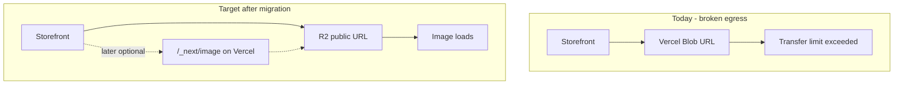

# Cloudflare R2 media migration (nabea.at)

## Decisions (locked)

- **Storage package:** `@payloadcms/storage-s3` pointed at Cloudflare R2’s S3-compatible API — **not** `@payloadcms/storage-r2`.
  - Payload docs: [`storage-r2`](https://payloadcms.com/docs/upload/storage-adapters) is for **Cloudflare Workers** (native R2 binding: `bucket: cloudflare.env.R2`).
  - Nabea runs on **Vercel / Node.js**, so Payload’s recommended path is **“Using with Cloudflare R2 (via S3 API)”** with `s3Storage`, `region: 'auto'`, `endpoint`, `forcePathStyle: true`, `generateFileURL` → public URL, and `disablePayloadAccessControl: true` (Media already has `read: () => true`).
- **Public URL (production):** Custom domain e.g. `https://media.nabea.at` on the bucket. Cloudflare documents `r2.dev` as **non-production / rate-limited**; custom domains unlock Cache, WAF, Bot Management ([Public buckets](https://developers.cloudflare.com/r2/buckets/public-buckets/)).
- **`r2.dev`:** Optional smoke-test only; do not CNAME DNS to `r2.dev`; avoid baking `pub-….r2.dev` URLs into Neon if the custom domain can be ready first.
- **CORS:** Add bucket CORS for `https://www.nabea.at` (+ apex / localhost) with `GET`/`HEAD` ([CORS](https://developers.cloudflare.com/r2/buckets/cors/)).
- **Tokens:** R2 API token, **Object Read & Write**, scoped to `nabea-media` only ([Authentication](https://developers.cloudflare.com/r2/api/tokens/)).
- **Image optimization:** After images work from R2, re-enable Vercel `next/image` (`unoptimized: false`). Cloudflare Image Resizing stays out of scope unless Vercel IO 402 returns.
- **Guide:** [`context-md/cloudflare-r2-setup-guide.md`](context-md/cloudflare-r2-setup-guide.md) (updated to match Cloudflare + Payload docs).

## Data safety — nothing is wiped

- **CMS content stays:** Products, pages, carts, orders, text, relationships — all live in **Neon/Postgres**. This migration does not delete or reset the database.
- **Media documents stay:** Each Payload `media` row (alt, caption, filename, links from products/pages) stays. We only **change the URL string** to point at R2 after files are copied.
- **Images are copied, not discarded:** Files are **copied** from Vercel Blob → R2. We do **not** delete Vercel Blob objects until the live site is verified working on R2 (keep Blob as backup).
- **Risk to manage:** If a copy fails for a specific file, that one image could 404 until fixed — so the migration script should report counts (source vs destination) and we verify before cutting over. We never “clear media and start over.”

## What “Cloudflare Image Resizing in front of R2” means (and why we skip it)

Today Next can rewrite image URLs through `/_next/image?url=…&w=…` (Vercel Image Optimization). That was previously failing with **402** (Vercel optimization quota), which is why [`next.config.js`](next.config.js) has `unoptimized: true`.

**Cloudflare Image Resizing** is a different product: Cloudflare sits on a domain (e.g. `media.nabea.at` or a Worker), fetches the original from R2, and returns resized/WebP variants via URL params or a Worker. The browser never hits Vercel’s `/_next/image`. Useful if Vercel IO quota stays a problem; you chose to try **Vercel Next Image again** after R2 works, so we leave CF resizing off unless IO 402 returns.

## Env vars I need from you (after you follow the guide)

Create these in Cloudflare, then send me the values (or set them on Vercel Production yourself and tell me the public URL + that keys are set):

| Variable | Where it comes from |
|----------|---------------------|
| `R2_ACCOUNT_ID` | Cloudflare dashboard → R2 → Overview (Account ID) |
| `R2_ACCESS_KEY_ID` | R2 → Manage R2 API Tokens → Access Key ID |
| `R2_SECRET_ACCESS_KEY` | Same token create dialog (shown once) |
| `R2_BUCKET` | Bucket name, e.g. `nabea-media` |
| `R2_ENDPOINT` | `https://<ACCOUNT_ID>.r2.cloudflarestorage.com` |
| `R2_PUBLIC_BASE_URL` | Prefer `https://media.nabea.at` (custom domain). `https://pub-….r2.dev` only for temporary testing |

Optional: keep `r2.dev` enabled for debugging, but production `R2_PUBLIC_BASE_URL` should be the custom domain.

Do **not** commit secrets. Prefer Vercel Production env + a local `.env` for the one-off migration script.

## Setup guide

Follow [`context-md/cloudflare-r2-setup-guide.md`](context-md/cloudflare-r2-setup-guide.md):

1. Create bucket `nabea-media` (avoid jurisdiction unless required).
2. Prefer **Custom Domain** `media.nabea.at` for production public URL; use `r2.dev` only to smoke-test.
3. Add CORS for the storefront origins.
4. Create R2 API token (Object Read & Write, bucket-scoped).
5. Build `R2_ENDPOINT` from Account ID; set env vars on Vercel.

## Implementation steps (ordered cutover)

**Live DB fact (checked):** almost all `media.url` values are relative Payload proxies (`/api/media/file/...`), **not** absolute `*.public.blob.vercel-storage.com` URLs. The rewrite step must target those relative paths (plus any absolute Blob URLs if found).

**Safe order — copy before cutover:**

1. **Copy files first** (site still on Vercel Blob):
   - Script uses `BLOB_READ_WRITE_TOKEN` → list/download Blob objects → upload to R2 with keys matching Payload `filename` / pathname.
   - Report copied / skipped / failed. Do **not** delete Blob.
2. **Code switch** (can be prepared in a PR, deploy after copy succeeds):
   - Add `@payloadcms/storage-s3@3.79.0` (done); replace `vercelBlobStorage` in [`src/payload.config.ts`](src/payload.config.ts) with Payload’s R2-via-S3 pattern (`region: 'auto'`, `endpoint`, `forcePathStyle: true`, `generateFileURL`, `disablePayloadAccessControl: true`).
   - Adjust [`src/collections/Media.ts`](src/collections/Media.ts) local `staticDir` only when R2 env missing.
   - Update [`next.config.js`](next.config.js) `remotePatterns` for `*.r2.dev` / `media.nabea.at` (keep Blob host temporarily).
   - Regenerate Payload import map (remove Vercel Blob client handler).
3. **Rewrite Neon URLs** (SQL you run on Neon):
   - Change `media.url` / `thumbnail_u_r_l` from `/api/media/file/<file>` → `${R2_PUBLIC_BASE_URL}/<filename>`.
   - Also rewrite any rare absolute Blob hosts if present.
4. **Deploy + verify** storefront images on R2.
5. **Later:** `images.unoptimized: false`; if `/_next/image` 402s again, keep unoptimized or reconsider CF Image Resizing.
6. **Later:** delete Vercel Blob objects only after confidence period.

## Out of scope for first fix

- Cloudflare Images / Image Resizing product
- Deleting Vercel Blob objects (keep until confirmed stable)
- Moving the Next.js app onto Cloudflare Workers (app stays on Vercel; R2 via S3 API is correct)

## What you do next

1. ~~R2 setup + Vercel env~~ (done / in progress).
2. Say **implement** when you want the copy script + code switch + Neon SQL.
3. Run copy → confirm counts → deploy switch + URL rewrite → verify shop.